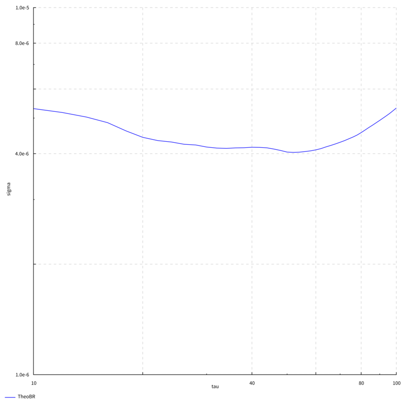
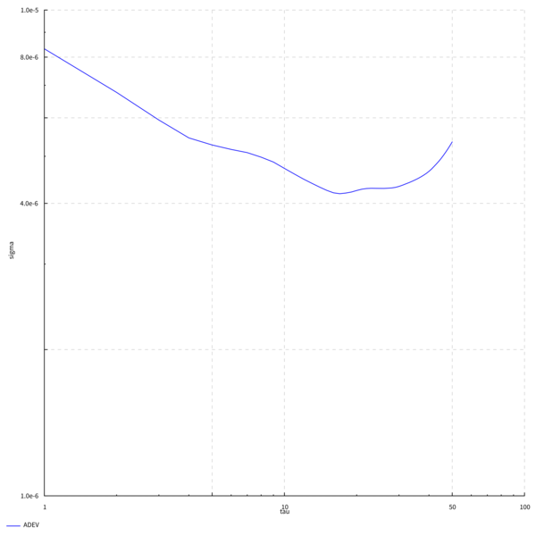

# `tau-sigma`: A Simple Utility for Frequency Stability Analysis

This is a simple command-line utilty for analyzing the frequency
stability of clocks in terms of their
[**Allan deviation**](http://en.wikipedia.org/wiki/Allan_variance).
It has the following subcommands:

1. `adev`: Read a phase error series from standard input and emit
   tau/sigma ADEV pairs to standard output as CSV.  Uses the standard
   overlapped Allan deviation estimator.
2. `theobr`: Like `adev` but uses TheoBR, a statistic for that
   produces better estimates of long-term stability (but is much
   slower than ADEV).
3. `loglog`: Generate a tau/sigma log-log chart from the output of
   `adev` or `theobr`.
4. `chart`: Generate a linear chart from time series data.  Meant for
   plotting time or frequency error series.
5. `noise`: A random spectral noise generator for white, flicker and
   random walk frequency noise types, and mixes thereof.
6. `convert`: Conversion between phase/frequency data series and units.

This tool has so far been written primarily with simplicity in mind,
not performance.

## Examples

### Random Noise

These examples are scripted in [`scripts/examples.sh`](scripts/examples.sh).

Noise Type                       | Time errors                    | Frequency errors                   | ADEV
---------------------------------|--------------------------------|------------------------------------|------------------------------
White phase modulation           |    |    | 
Flicker phase modulation         |    |    | 
White frequency modulation       |    |    | 
Flicker frequency modulation     |    |    | 
Random walk frequency modulation |  |  | 

### Earth Rotation, 1962-2015

The rotation of our planet is not stable.  We can illustrate by
applying `tau-sigma` to data from the
[International Earth Rotation Service](http://www.iers.org/IERS/EN/Home/home_node.html):

This example is scripted in [`scripts/iers.sh`](scripts/iers.sh).  More
about the data in [`example-data/README.md`](example-data/README.md).

### Arnold #36 pocket chronometer

I wrote this utilty to help me in my quest to understand the
performance of historical precision timepieces.  Here's a fine
example: the 1779/80 Greenwich trial of
[John Arnold's pocket chronometer #36](http://collections.rmg.co.uk/collections/objects/207131.html),
one of the very earliest successful precision watches.  Read more in
[`example-data/README.md`](example-data/README.md).

Daily Rates                             | Time error                          | ADEV
----------------------------------------|-------------------------------------|----------------------------------
 |  | 

## Correctness

I do not warranty that the results of this program are always correct.
If you crash a satellite or something because of an error in my
program that's your fault.

Nevertheless, I have taken care to test that the results at least look
sensible.  The following properties are tested:

1. The results of most of the frequency stability functions are
   compared against the ones published by Riley and Howe (2008) for
   two public data sets.  See:
  * [`NBSSpec.hs`](test/TauSigma/Statistics/NBSSpec.hs)
  * [`RileySpec.hs`](test/TauSigma/Statistics/RileySpec.hs)
2. There's also tests that check that the slopes of the statistics
   are more or less what they should be on various noise types.   See:
  * [`AllanSpec.hs`](test/TauSigma/Statistics/AllanSpec.hs)
  * [`HadamardSpec.hs`](test/TauSigma/Statistics/HadamardSpec.hs)
  * [`Theo1Spec.hs`](test/TauSigma/Statistics/Theo1Spec.hs)
  * [`TotalSpec.hs`](test/TauSigma/Statistics/TotalSpec.hs)

Not all statistics are subjected to all the tests just yet.  In
particular, I don't have example data sets of the TheoBR statistic to
compare against.  It passes its slope tests but *caveat emptor*.

## Compilation and Installation

This is a pure [Haskell](https://www.haskell.org/) program built with
the [Stack tool](http://haskellstack.org/), so you need to install
that to compile the program.

Once you've done that the installation follows standard Stack procedure:

1. Clone this Git repo.
2. Change into the base directory and run `stack install`.

This will install the `tau-sigma` commandline program to the location
where the Stack tool puts executable programs (default `~/.local/bin/`
in Unix and OS X systems).

## TODO

* Error bars!
* Triple check the flicker noise generation code.
* Smart scaling of log/log chart axes.  We need same-sized decades in
  both axes.
* Generate charts in other formats than SVG.
* Frequency spectra
* Other stability statistics

## References

* Howe, D.A. and T.N. Tasset.  2004.
  ["Theo1: Characterization of very long-term frequency stability."](http://tf.nist.gov/timefreq/general/pdf/1990.pdf)
  *Proceedings of the 18th European Frequency and Time Forum (2004)*.
* Riley, William and David A. Howe.  2008.
  [*Handbook of Frequency Stability Analysis*](http://tf.nist.gov/general/pdf/2220.pdf).
  National Institute of Standards and Technology Special Publication
  1065, July 2008. Boulder, Colorado: National Institute of Standards
  and Technology.
