# `tau-sigma`: A Simple Utility for Frequency Stability Analysis

This is a simple command-line utilty for analyzing the frequency
stability of clocks in terms of their
[**Allan deviation**](http://en.wikipedia.org/wiki/Allan_variance).
It has the following subcommands:

## Subcommands

### Statistics

All of these commands take time error data as input, one item per line:

Command            | Description
-------------------|---------------------------------------------------------
`tau-sigma adev`   | Allan deviation (overlapped estimator)
`tau-sigma mdev`   | Modified Allan deviation
`tau-sigma tdev`   | Time deviation
`tau-sigma hdev`   | Hadamard deviation (overlapped estimator)
`tau-sigma totdev` | Total deviation
`tau-sigma theobr` | TheoBR deviation (bias-reduced Theo1)
`tau-sigma theoh`  | TheoH deviation (Allan at low taus, TheoBR at high taus)

Output is CSV with "tau" and "sigma" column headers.

### Charting

This isn't meant to be a full-powered charting tool, but it's useful
to be able to generate quick-and-dirty plots.

The `tau-sigma chart` command generate a line chart from time series
data.  This is meant for plotting time or frequency error series.

The `tau-sigma loglog` commands generates a tau/sigma log-log chart
from the output of the stability statistic subcommands.  The data is
plotted with square decades to help judge the slopes of the curve.

### Noise

The `tau-sigma noise` command generates random spectral noises and
mixes thereof.

### Convert

The `tau-sigma convert` command converts between phase/frequency data
series and units.

## Examples

### Random Noise

These examples are scripted in [`scripts/examples.sh`](scripts/examples.sh).

Noise Type                       | Time errors                    | Frequency errors                   | ADEV
---------------------------------|--------------------------------|------------------------------------|------------------------------
White phase modulation           | 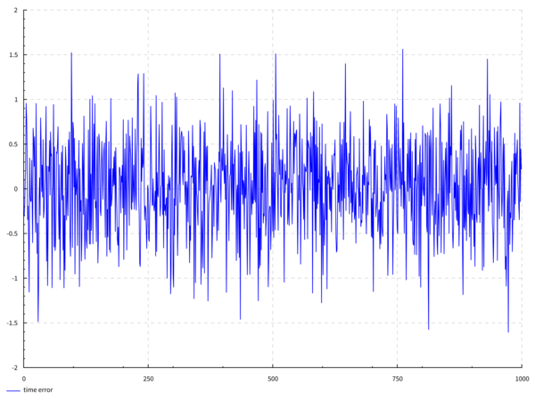   | 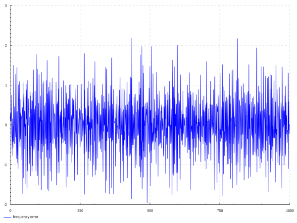   | 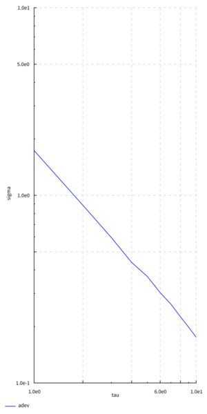
Flicker phase modulation         | 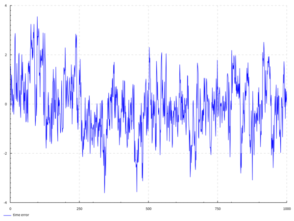   | 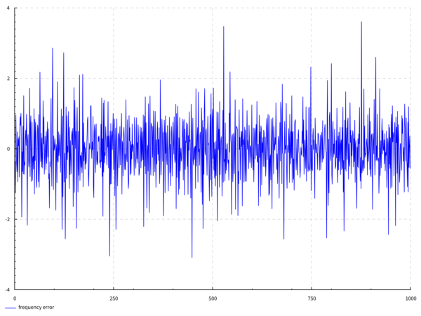   | 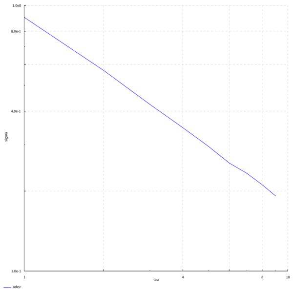
White frequency modulation       | 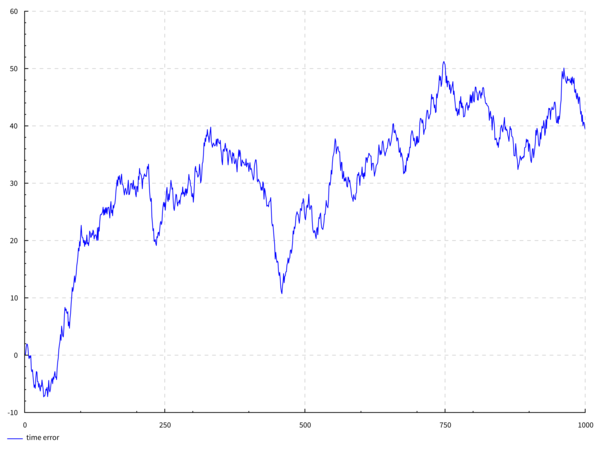   | 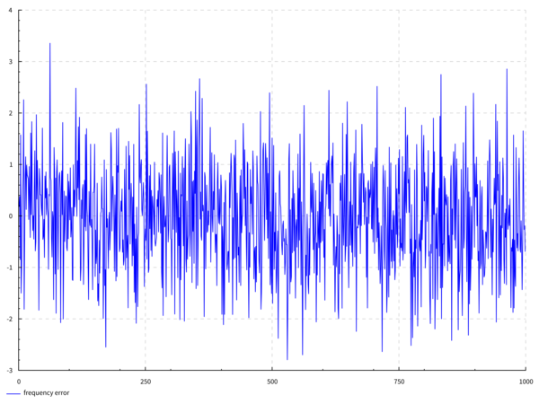   | 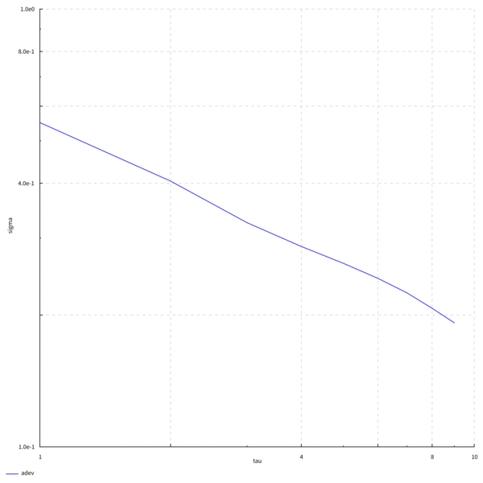
Flicker frequency modulation     | 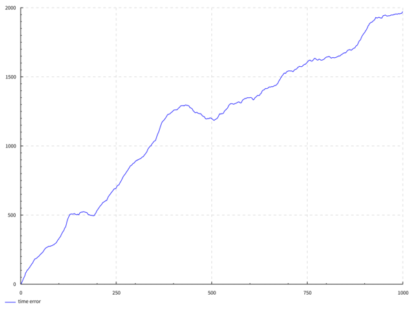   | 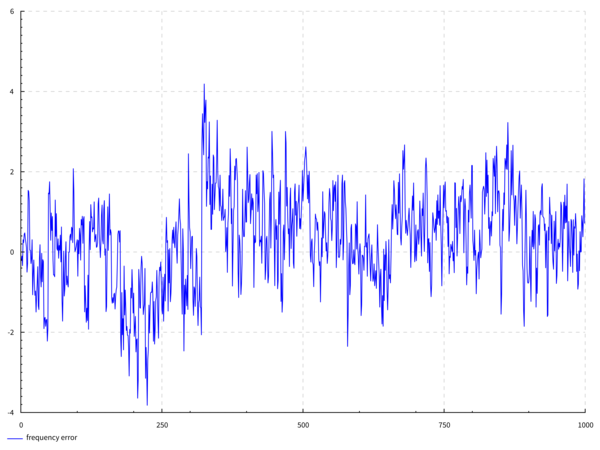   | 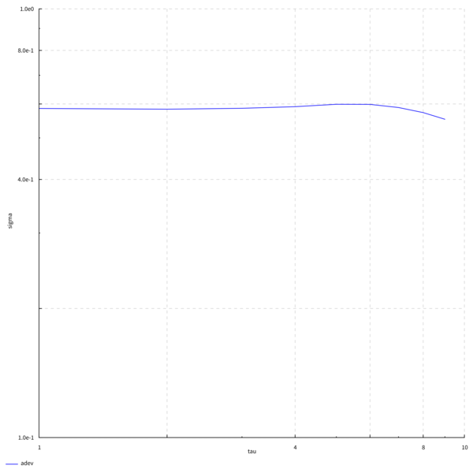
Random walk frequency modulation | 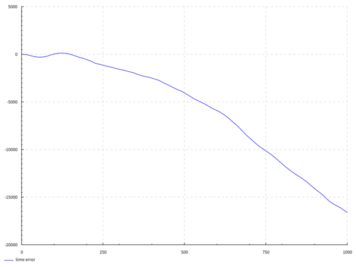 | 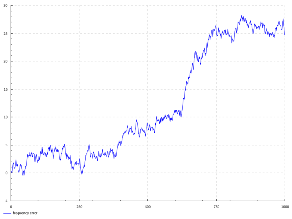 | 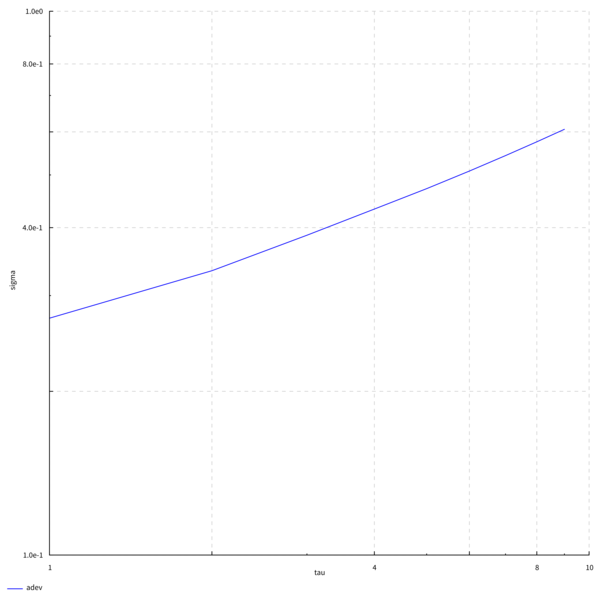

### Earth Rotation, 1962-2015

The rotation of our planet is not stable.  We can illustrate by
applying `tau-sigma` to data from the
[International Earth Rotation Service](http://www.iers.org/IERS/EN/Home/home_node.html):

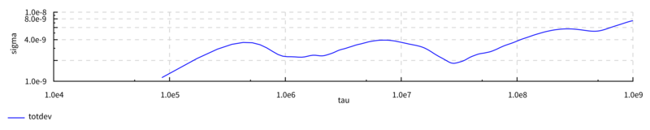

This example is scripted in [`scripts/iers.sh`](scripts/iers.sh).  More
about the data in [`example-data/README.md`](example-data/README.md).

### Arnold #36 pocket chronometer

I wrote this utilty to help me in my quest to understand the
performance of historical precision timepieces.  Here's a fine
example: the 1779/80 Greenwich trial of
[John Arnold's pocket chronometer #36](http://collections.rmg.co.uk/collections/objects/207131.html),
one of the very earliest successful precision watches.  Read more in
[`example-data/README.md`](example-data/README.md).

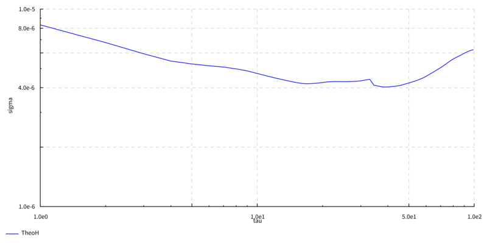

Daily Rates                             | Time error                         
----------------------------------------|------------------------------------
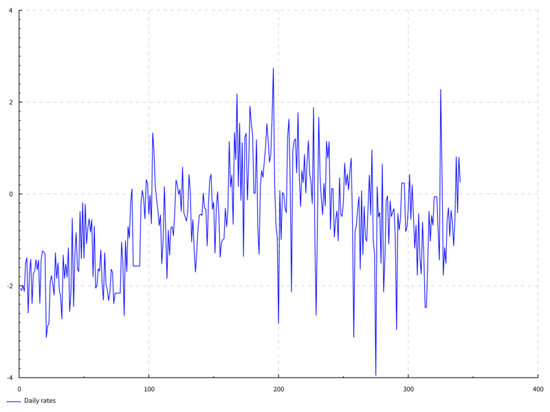 | 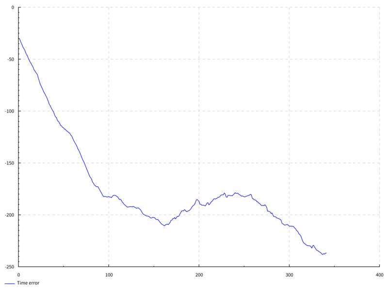

## Performance and correctness

This tool has so far been written primarily with simplicity and
correctness in mind, not performance.

I do not warranty that the results of this program are always correct.
Nevertheless, I have taken care to test that the results at least look
sensible.  The following properties are tested:

1. The results of most of the frequency stability functions are
   compared against the ones published by Riley and Howe (2008) for
   two public data sets.  See:
  * [`NBSSpec.hs`](test/TauSigma/Statistics/NBSSpec.hs)
  * [`RileySpec.hs`](test/TauSigma/Statistics/RileySpec.hs)
2. The Theo1 statistic is tested against an example in Appendix A of
   Howe (2006).  See:
  * [`HoweSpec.hs`](test/TauSigma/Statistics/HoweSpec.hs)
3. There's also tests that check that the slopes of the statistics
   are more or less what they should be on various noise types.   See:
  * [`AllanSpec.hs`](test/TauSigma/Statistics/AllanSpec.hs)
  * [`HadamardSpec.hs`](test/TauSigma/Statistics/HadamardSpec.hs)
  * [`Theo1Spec.hs`](test/TauSigma/Statistics/Theo1Spec.hs)
  * [`TotalSpec.hs`](test/TauSigma/Statistics/TotalSpec.hs)

Not all statistics are subjected to all the tests just yet.  In
particular, I don't have example data sets of the TheoBR or TheoH
statistics to compare against.  (These are derived from the Allan and
Theo1 deviations, which I do test.)

## Compilation and Installation

This is a pure [Haskell](https://www.haskell.org/) program built with
the [Stack tool](http://haskellstack.org/), so you need to install
that to compile the program.

Once you've done that the installation follows standard Stack procedure:

1. Clone this Git repo.
2. Change into the base directory and run `stack install`.

This will install the `tau-sigma` commandline program to the location
where the Stack tool puts executable programs (default `~/.local/bin/`
in Unix and OS X systems).

## TODO

* Error bars!
* Triple check the flicker noise generation code.
* Smart scaling of log/log chart axes.  We need same-sized decades in
  both axes.
* Generate charts in other formats than SVG.
* Frequency spectra
* Other stability statistics

## References

* Howe, D.A. 2006.
  ["TheoH: a hybrid, high-confidence statistic that improves on the Allan deviation."](http://tf.nist.gov/timefreq/general/pdf/1990.pdf)
  *Metrologia* 43 (2006) S322-331.
* Riley, William and David A. Howe.  2008.
  [*Handbook of Frequency Stability Analysis*](http://tf.nist.gov/general/pdf/2220.pdf).
  National Institute of Standards and Technology Special Publication
  1065, July 2008. Boulder, Colorado: National Institute of Standards
  and Technology.
* Tange, O.  2011.  "GNU Parallel - The Command-Line Power Tool."
  *;login: The USENIX Maganize*, vol. 36, No.1 (Feb. 2011), pp. 42-47.
